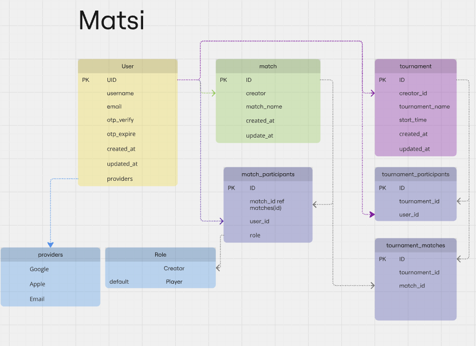

# DOCUMENTATION

Matsi is an application designed to provide users with detailed statistics about their games. Games can range from board games to PlayStation matches, or any competition where two users engage against each other.

## Back-End & Database

The backend of the Matsi application relies on a structured and scalable database architecture to manage user information, game statistics, and related data. Below is the visual representation of the database structure:

Matsi Database Architecture

### Key Entities in the Database

1. Users Table:

#### Manages user details, including:

- Unique identifiers (UUID).
- Username and email address.
- OTP-based authentication.
- Timestamped tracking for account creation and updates.
- Supports authentication via multiple providers (Email, Google, Apple).

2. Matches Table:

#### Stores details of individual matches, such as:

- Match creator.
- Participants.
- Match metadata (name, timestamp, etc.).

3. Tournaments Table:

- Organizes multiple matches into competitive tournaments.
- Tracks tournament creator, participants, and match results.

4. Participants Tables:

- Separate tables for match and tournament participants.
- Track user roles (creator, player) and their relation to matches or tournaments.

## Server endpoints

### Authentication endpoints

- POST api/auth/request
- POST api/auth/verify
- POST api/auth/apple

### Users endpoints

COMING....

## Summary

### Technologies Used

- Node.js: Server-side runtime for handling requests and managing backend logic.
- Express.js: Framework for creating RESTful endpoints.
- PostgreSQL: Database for storing relational data.
- Nodemailer: Used for sending email-based OTPs.
- JWT (JSON Web Tokens): For secure user authentication.

## Front-End
